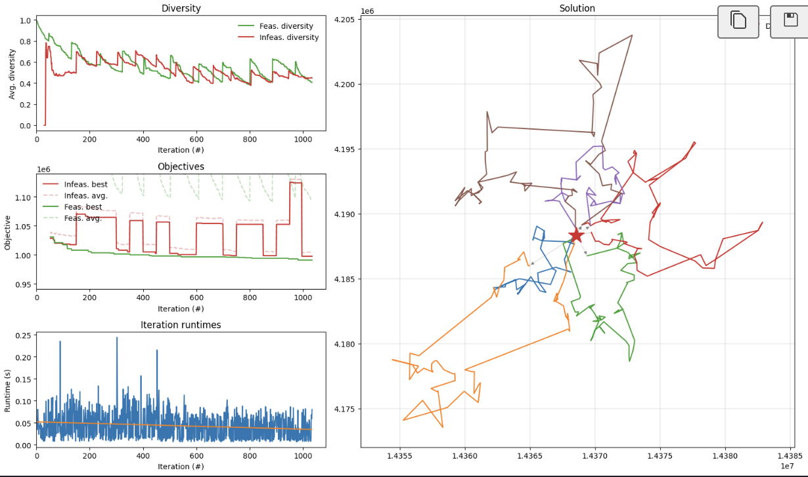
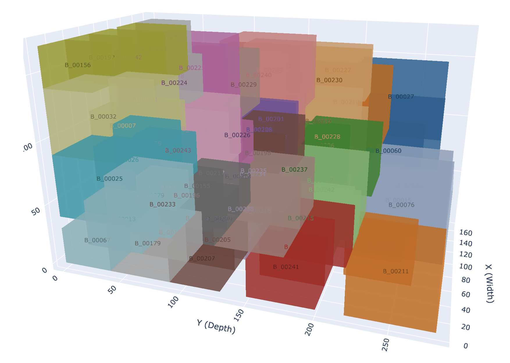

## Route Optimization

### **데이터**

- **OD Matrix**: 착지 및 센터 간의 거리 정보 (Integer) → distance-data.txt
- **Depot 위치**: 물류센터 좌표 (위/경도) → Data_Set.json
- **Destinations**: 각 착지별 위치 정보 (위/경도) → Data_Set.json

### **제약 조건**

- **차량 수**: 무제한
- **다회전 불가**: 차량은 **한 번의 여행으로 할당된 모든 배송을 완료**
- 각 착지는 차량 1대가 1번만 방문

### **비용**

- **고정비**: 차량 1대당 150,000원
- **유류비**: 거리 × 500원/km

## Load Optimization

### **데이터**

- **Orders 상세 정보**:
    - Order number: 주문 번호 → Data_Set.json
    - Box ID: 상품 ID → Data_Set.json
    - Destination: 착지 번호 → Data_Set.json
    - Dimension: 상품 크기 (넓이, 길이, 높이) → Data_Set.json

### **차량 적재 제약**

- **적재함 크기**: 넓이×깊이×높이
- **좌표계**: Right-handed coordinate system
- **Origin**: 적재함 가장 안쪽 좌측 (0,0,0)
- **출입구**: XZ plane (Y=280cm) - 도어 위치

### **적재/하차 규칙**

- **LIFO 방식**
- **셔플링 비용**: 500원/회
- **셔플링**: 상품을 꺼내기 위해 다른 상품을 이동하는 횟수

## Evaluation

라우팅 비용 = 고정비 + 유류비

- 고정비 : 차량 1대 사용하는데에 따른 고정비용, 150,000원
- 유류비 : 거리에 따른 유류비용, 500원/km

하차 비용 = 셔플링 횟수 x 셔플링 비용

- 셔플링 횟수 : 상품을 꺼내기 위하여 이동해야하는 주변 상품의 수
- 셔플링 비용 : 500원/셔플링

Total Score= 라우팅 비용 + 하차 비용 (Total Score가 작은 팀이 우승)

## Route Optimization Visualization

## Load Optimization Visualization

